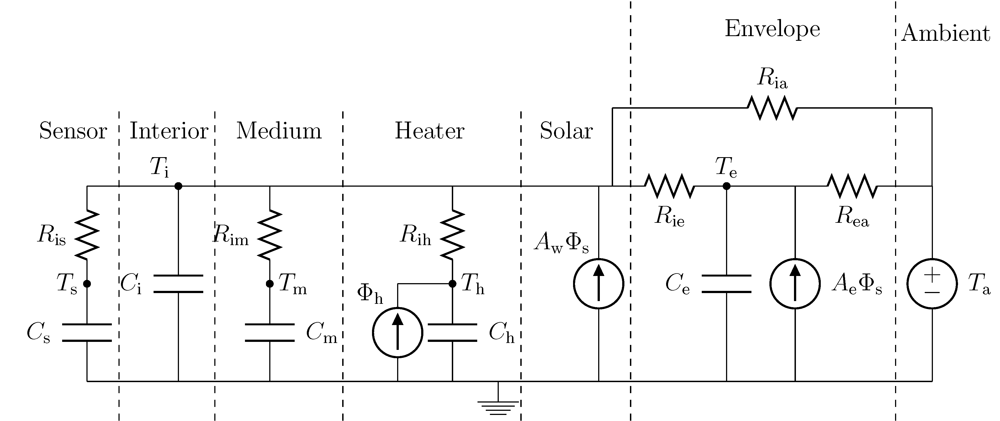
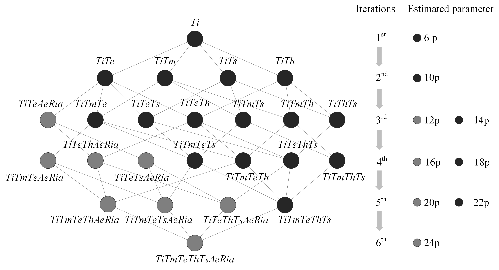
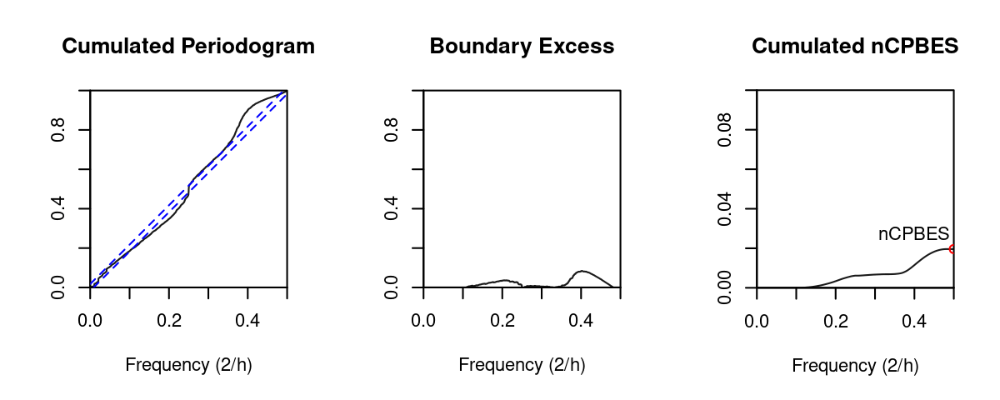

# Fifty shades of grey

This repository presents the implementation section of the open-access journal article [Fifty shades of grey: Automated stochastic model identification of building heat dynamics](https://doi.org/10.1016/j.enbuild.2022.112095) examplified on a toy-set of 3 anonymized buildings.

To get started, simply clone this repository on your computer or Fork it via GitHub. After installing dependencies from  the `requirements.txt` file, the code should run properly.

### Citation
If you find this code useful and use it in your work, please reference our journal article:

[Leprince, J., Madsen, H., Miller, C., Real, J.P., Basu, K. and Zeiler, W., 2022. Fifty shades of grey: Automated stochastic model identification of building heat dynamics. Energy and Buildings, p.112095.](https://doi.org/10.1016/j.enbuild.2022.112095)

```

@article{LEPRINCE2022112095,
title = {Fifty shades of grey: Automated stochastic model identification of building heat dynamics},
journal = {Energy and Buildings},
volume = {266},
pages = {112095},
year = {2022},
issn = {0378-7788},
doi = {https://doi.org/10.1016/j.enbuild.2022.112095},
url = {https://www.sciencedirect.com/science/article/pii/S0378778822002663},
author = {Julien Leprince and Henrik Madsen and Clayton Miller and Jaume Palmer Real and Rik {van der Vlist} and Kaustav Basu and Wim Zeiler},
keywords = {Buildings, Automation, Grey-box models, Heat dynamics, Scalable approaches, Performance benchmarks},
abstract = {To reach the carbon emission reduction targets set by the European Union, the building sector has embraced multiple strategies such as building retrofit, demand side management, model predictive control and building load forecasting. All of which require knowledge of the building dynamics in order to effectively perform. However, the scaling-up of building modelling approaches is still, as of today, a recurrent challenge in the field. The heterogeneous building stock makes it tedious to tailor interpretable approaches in a scalable way. This work puts forward an automated and scalable method for stochastic model identification of building heat dynamics, implemented on a set of 247 Dutch residential buildings. From established models and selection approach, automation extensions were proposed along with a novel residual auto-correlation indicator, i.e., normalized Cumulated Periodogram Boundary Excess Sum (nCPBES), to classify obtained model fits. Out of the available building stock, 93 building heat dynamics models were identified as good fits, 95 were classified as close and 59 were designed as poor. The identified model parameters were leveraged to estimate thermal characteristics of the buildings to support building energy benchmarking, in particular, building envelope insulation performance. To encourage the dissimination of the work and assure reproducibility, the entire code base can be found on Github along with an example data set of 3 anonymized buildings. The presented method takes an important step towards the automation of building modeling approaches in the sector. It allows the development of applications at large-scale, enhancing building performance benchmarks, boosting city-scale building stock scenario modeling and assisting end-use load identifications as well as building energy flexibility potential estimation.}
}

```

## Repository structure
```
fiftyshadesofgrey
└─ data
|   ├─ in                               <- input example data-sets of 3 buildings
|   └─ out                              <- model fitting output results
└─ fig                                  <- figures outputs
└─ src
|   ├─ 0 exploratory analysis           <- visual exploratory analysis of input data
|   ├─ 1a model selection               <- RC model selection in series
|   ├─ 1b model selection               <- RC model selection in parallel
|   ├─ 2 results processing             <- selected model postprocessing
|   ├─ 3 model evaluation               <- model fit quality evaluation
|   ├─ 4 results plots                  <- visualizing results
|   ├─ RC models                        <- all building thermal RC models
|   └─ utility functions                <- various utility functions
└─ README.md                            <- README for developers using this code
```
<!-- fiftyshadesofgrey
└─ [data](https://github.com/JulienLeprince/fiftyshadesofgrey/tree/main/src/data)
|   ├─ [in](https://github.com/JulienLeprince/fiftyshadesofgrey/tree/main/src/data/in)            <- input example data-sets of 3 buildings
|   └─ [out](https://github.com/JulienLeprince/fiftyshadesofgrey/tree/main/src/data/out)            <- model fitting output results
└─ [figures](https://github.com/JulienLeprince/fiftyshadesofgrey/tree/main/fig)                <- figures outputs
└─ [src](https://github.com/JulienLeprince/fiftyshadesofgrey/tree/main/src)
|   ├─ [0 exploratory analysis](https://github.com/JulienLeprince/fiftyshadesofgrey/blob/main/src/main0_VisualExploratoryAnalysis.Rmd)            <- visual exploratory analysis of input data
|   ├─ [1a model selection](https://github.com/JulienLeprince/fiftyshadesofgrey/blob/main/src/main1_modelselection_inseriesloop.R)            <- RC model selection in series
|   ├─ [1b model selection](https://github.com/JulienLeprince/fiftyshadesofgrey/blob/main/src/main1_modelselection_parallelloop.R)            <- RC model selection in parallel
|   ├─ [2 results processing](https://github.com/JulienLeprince/fiftyshadesofgrey/blob/main/src/main2_resultsprocessing.R)            <- selected model postprocessing
|   ├─ [3 model evaluation](https://github.com/JulienLeprince/fiftyshadesofgrey/blob/main/src/main3_modelevaluation.R)            <- model fit quality evaluation
|   ├─ [4 results plots](https://github.com/JulienLeprince/fiftyshadesofgrey/blob/main/src/results_plots.ipynb)            <- visualizing results
|   ├─ [RC models](https://github.com/JulienLeprince/fiftyshadesofgrey/blob/main/src/allmodels.R)            <- all building thermal RC models
|   └─ [utility functions](https://github.com/JulienLeprince/fiftyshadesofgrey/blob/main/src/utils.R)            <- various utility functions
└─ README.md              <- 50SoG README for developers using this code -->

## Automated building thermal dynamics model identification

### Applied models

This study considers grey-box models ranging from simple first order model *Ti*, where the inside temperature state-point *Ti* and its RC parameters *Ria* and *Ci* are solely treated, to 5th order ones, where the addition of sensor *Ts*, medium *Tm*, heater *Th* and building envelope *Te* state points along with their respective RC parameters each add a variety of model extensions to chose from. Additionally, the building envelope component proposes additional parameter extensions modeling direct inside to outside heat exchanges and facade solar gains, which are here considered as a block extension *AeRia*.
The full model *TiTmTeThTsAeRia* is presented below (reprinted from the work of [Bacher and Madsen](https://www.sciencedirect.com/science/article/pii/S0378778811000491) with their approval)



For a detailed description of the grey-box models, the enthuastic reader is suggested to refer to the work of [Bacher and Madsen](https://www.sciencedirect.com/science/article/pii/S0378778811000491).

### Model selection

The model selection procedure employs a likelihood ratio test to statistically determine whether a more complex model performs significantly better, or not, compared to a simpler, sub-model.
A forward selection procedure is proposed beginning with the simplest feasible model, *Ti*, and extending it iteratively with the component presenting the most significant improvement. The procedure terminates when no model extension yields a p-value below the pre-specified limit, commonly fixed at 5\%.
Possible candidates for model improvement are selected from a set of predefined extensions, resulting from the combination possibilities of the different considered model components, i.e., *Te*, *Th*, *Tm*, *Ts*, *AeRia*. 
The overall model selection scheme is presented below. Possible model combinations are mapped and linked, visually exposing the different existing paths of the forward selection procedure.



Grey-box models are here implemented using the computer software [CTSM-R](http://ctsm.info/) developed at the Technical University of Denmark. It produces maximum likelihood estimates of model parameters thanks to an optimization algorithm performed over a Kalman filter.


### Model evaluation

Models are finally evaluated leveraging the commonly employed qualitative appreciation of model fits from cumulated periodograms of the residuals.
Typically, an appropriate model will produce residuals with Gaussian white-noise properties, which in the frequency domain, denotes a theoretical constant periodogram. Observing whether obtained model residuals are located around this straight line, e.g. within a surrounding confidence interval, consequently serves as an appropriate indicator of a model's quality.

By calculating the frequency differences between a selected model's Cumulated Periodogram (CP) and its confidence interval, we obtain boundary excess values which, in turn, can be summed into a unique numerical indicator, i.e., the Cumulated Periodogram Boundary Excess Sum (CPBES). This indicator characterizes the amount of auto-correlation present in the considered time-series, which implies white noise properties when close to zero. CPBES consequently allows the differentiation of poor, suitable and good models resulting from the previous forward selection procedure. To allow fair comparisons of CPBES between times series of different length, we normalize it by its length, and obtain the normalized CPBES (nCPBES).




## Authors

[Julien Leprince](https://github.com/JulienLeprince),
Prof. [Henrik Madsen](https://henrikmadsen.org/),
Prof. [Clayton Miller](https://github.com/cmiller8),
[Jaume Palmer Real](https://orbit.dtu.dk/en/persons/jaume-palmer-real),
[Rik van der Vlist](https://www.linkedin.com/in/rik-van-der-vlist-124b62138/),
Dr. [Kaustav Basu](https://www.linkedin.com/in/kaustav-basu-phd-5973311b/),
Prof. [Wim Zeiler](https://www.tue.nl/en/research/researchers/wim-zeiler/).


## License

This project is licensed under the MIT License - see the [LICENSE.md](LICENSE.md) file for details